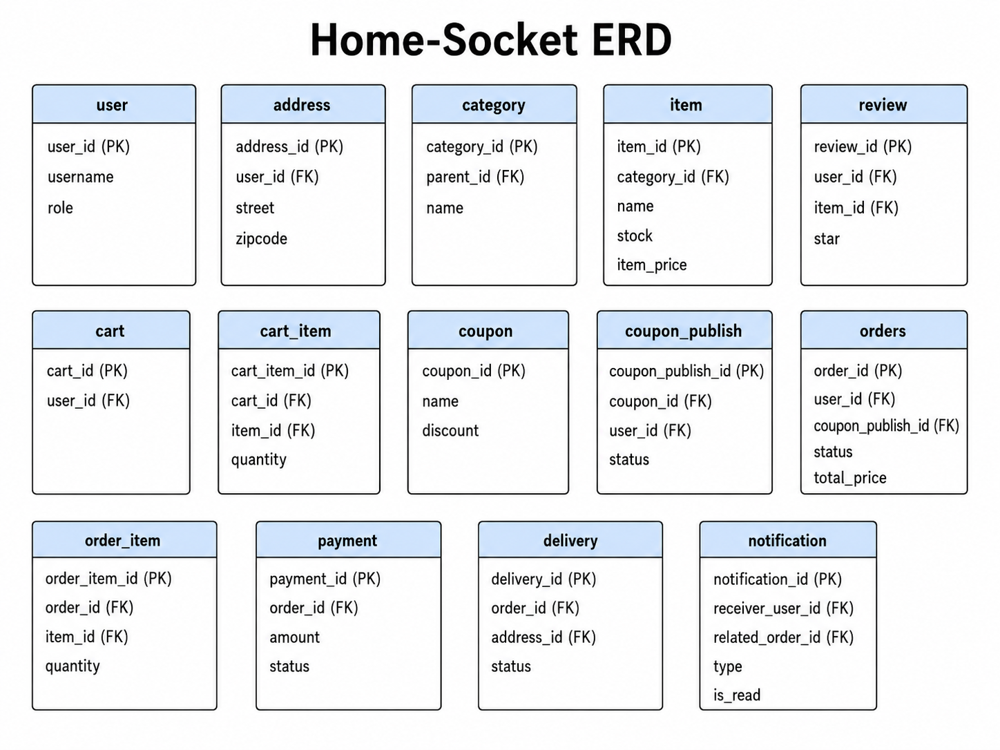
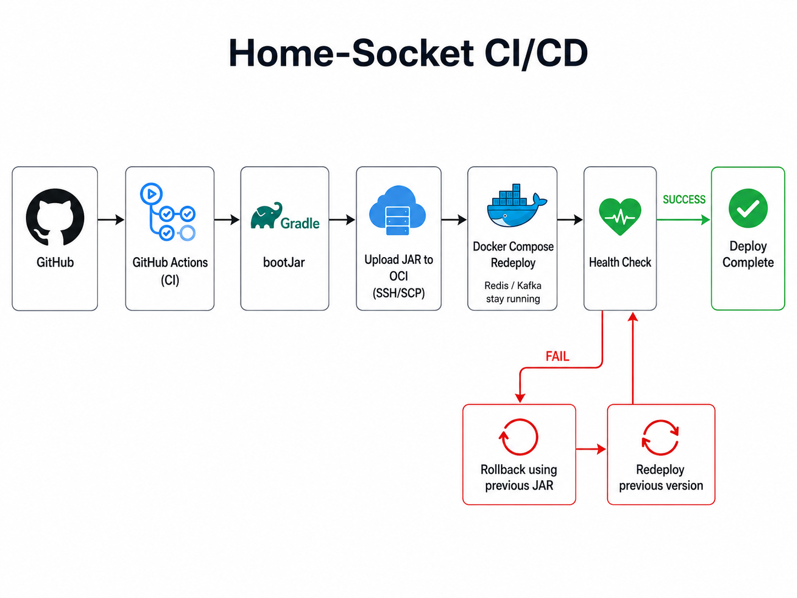

# Home-Socket

> 기존 쇼핑몰 백엔드 프로젝트를 리팩토링하고, 캐싱·이벤트 처리·배포 자동화·운영 보안을 추가한 Spring Boot 기반 쇼핑몰 백엔드 프로젝트입니다.

Home-Socket은 회원, 상품/카테고리, 장바구니, 주문, 결제, 배송, 쿠폰, 리뷰 기능을 제공하는 쇼핑몰 백엔드입니다. 기존 프로젝트에서 경험한 배포 및 운영상의 한계를 개선하기 위해 PostgreSQL, Redis, Kafka, WebSocket, GitHub Actions, Oracle Cloud, Nginx, HTTPS, Fail2Ban을 적용했습니다.

결제 완료 시 `order.paid` Kafka 이벤트를 발행하고, Consumer가 사용자/관리자 알림을 저장한 뒤 WebSocket/STOMP로 실시간 알림을 전달합니다. 카테고리·상품·리뷰 조회 API에는 Redis 캐시를 적용했고, Flyway 마이그레이션으로 스키마와 인덱스를 관리합니다.

---

## 목차

- [주요 기능](#주요-기능)
- [기술 스택](#기술-스택)
- [아키텍처](#아키텍처)
- [Database Schema](#database-schema)
- [주요 구현 내용](#주요-구현-내용)
- [성능 개선](#성능-개선)
- [배포 및 운영](#배포-및-운영)
- [CI/CD](#cicd)
- [프로젝트 구조](#프로젝트-구조)
- [로컬 실행](#로컬-실행)
- [환경 변수](#환경-변수)
- [API 문서](#api-문서)
- [관련 문서](#관련-문서)

---

## 주요 기능

### 인증/인가

- JWT 기반 회원가입, 로그인, 토큰 재발급
- Google/Naver OAuth2 로그인
- `ROLE_USER`, `ROLE_ADMIN` 기반 API 권한 분리
- Spring Security 기반 401/403 공통 JSON 응답 처리

### 쇼핑몰 도메인

- 카테고리 계층 조회
- 상품 등록, 수정, 삭제, 조회
- 장바구니 상품 추가, 수량 변경, 선택 삭제, 전체 비우기
- 장바구니 기반 주문 생성
- 재고 차감, 쿠폰 사용, 주문 취소
- Mock 결제 승인 및 결제 성공/실패 상태 관리
- 배송 상태 관리
- 리뷰 생성, 수정, 삭제, 조회

### 캐싱/이벤트/알림

- Redis 기반 카테고리, 상품, 리뷰 조회 캐싱
- 상품/카테고리/리뷰/주문 변경 시 관련 캐시 무효화
- 결제 완료 후 트랜잭션 커밋 이후 Kafka 이벤트 발행
- `order.paid` 이벤트 Consumer에서 알림 저장
- 사용자/관리자 대상 WebSocket 실시간 알림 전송
- 이벤트 중복 처리를 막기 위한 `dedup_key` 적용

### 운영/배포

- Oracle Cloud 인스턴스 2대 구성: App 서버와 DB 서버 분리
- Nginx Reverse Proxy 및 HTTPS 적용
- Spring Boot app은 `127.0.0.1:8081`에만 바인딩하여 직접 외부 노출 방지
- PostgreSQL은 private network에서만 접근
- GitHub Actions 기반 CI/CD
- 배포 후 health check 및 실패 시 rollback
- Fail2Ban, SSH key-only, iptables, OCI Security List 기반 기본 보안 구성

---

## 기술 스택

| 분류 | 기술 |
|---|---|
| Language | Java 21 |
| Framework | Spring Boot 3.5.4 |
| Build | Gradle 8.14.3 Wrapper |
| Security | Spring Security, JWT, OAuth2 Client |
| Database | PostgreSQL |
| ORM / Migration | Spring Data JPA, Hibernate, Flyway |
| Cache | Redis, Spring Cache |
| Messaging | Kafka, Spring Kafka |
| Realtime | Spring WebSocket, STOMP |
| API Docs | springdoc-openapi, Swagger UI |
| Test | JUnit 5, Spring Security Test, Spring Kafka Test |
| Performance Test | k6, Node.js 분석 스크립트 |
| Infra | Oracle Cloud, Docker, Docker Compose, Nginx |
| CI/CD | GitHub Actions |
| Security / Ops | HTTPS, Fail2Ban, SSH key-only, iptables |

---

## 아키텍처


운영 환경에서는 외부 요청이 반드시 Nginx를 통해 들어오도록 구성했습니다. Spring Boot app은 `127.0.0.1:8081`에만 바인딩되어 외부에서 직접 접근할 수 없고, Redis/Kafka/PostgreSQL도 외부에 직접 노출하지 않습니다.

자세한 배포 구조는 [docs/deployment.md](docs/deployment.md)를 참고하세요.

---

## Database Schema



가독성을 위해 관계선은 생략하고, 주요 테이블과 PK/FK 컬럼 중심으로 정리했습니다. 테이블 간 관계는 각 테이블의 FK 컬럼을 기준으로 구성됩니다.

### 주요 관계

- `user`는 `address`, `cart`, `orders`, `review`, `coupon_publish`, `notification`과 연결됩니다.
- `category`는 `parent_id`를 통해 self-reference 구조를 가지며, 하위 카테고리를 표현합니다.
- `category`는 여러 `item`을 가질 수 있습니다.
- `cart`는 여러 `cart_item`을 가지며, `cart_item`은 `item`을 참조합니다.
- `orders`는 여러 `order_item`을 가지며, `payment`, `delivery`, `notification`과 연결됩니다.
- `coupon`은 `coupon_publish`를 통해 사용자에게 발급되고, 주문 시 `orders`에서 참조됩니다.

---

## 주요 구현 내용

### 1. 주문/결제 트랜잭션과 이벤트 분리

주문 생성 시 장바구니 상품, 상품 재고, 발급 쿠폰에 lock을 적용하여 동시 주문 상황에서 재고와 쿠폰 상태가 꼬이지 않도록 했습니다.

결제 승인 후에는 주문과 결제 상태를 DB에 반영한 뒤, 트랜잭션 커밋 이후 `order.paid` Kafka 이벤트를 발행합니다.

```text
주문 생성
→ 재고 차감 / 쿠폰 사용
→ 결제 승인
→ 주문 PAID, 결제 APPROVED
→ Transaction Commit
→ order.paid Kafka event 발행
→ 알림 저장 및 WebSocket 전송
```

### 2. Kafka 기반 결제 완료 이벤트 처리

`OrderEventPublisher`는 트랜잭션이 성공적으로 commit된 이후 Kafka에 이벤트를 발행합니다. Consumer는 `order.paid` 이벤트를 수신해 사용자 알림과 관리자 알림을 생성합니다.

중복 이벤트 처리를 방지하기 위해 알림 테이블에 `dedup_key` unique 제약을 두었습니다.

### 3. Redis 캐싱

조회 빈도가 높은 카테고리, 상품, 리뷰 API에 Redis Cache를 적용했습니다. cache name별 TTL을 다르게 설정해 데이터 특성에 맞게 캐시 유지 시간을 조정했습니다.

| Cache | TTL |
|---|---:|
| `getRootCategory` | 12시간 |
| `getChildCategory` | 12시간 |
| `getItem` | 3분 |
| `getAllItem` | 1분 |
| `getItemsByCategory` | 1분 |
| `getReview` | 3분 |
| `getItemReview` | 3분 |

### 4. WebSocket 실시간 알림

STOMP endpoint를 통해 클라이언트가 접속하고, JWT를 STOMP header에 전달하여 인증합니다.

| Destination | 설명 |
|---|---|
| `/user/queue/notifications` | 사용자 개인 알림 |
| `/user/queue/admin-notifications` | 관리자 알림 |

### 5. Flyway 기반 DB 마이그레이션

PostgreSQL schema는 Flyway migration으로 관리합니다.

| Version | 내용 |
|---|---|
| `V1` | 회원, 카테고리, 상품, 쿠폰, 주문, 장바구니, 배송지, 배송, 리뷰 기본 테이블 |
| `V2` | 쿠폰 발급/장바구니 아이템 중복 방지 unique index |
| `V3` | 조회/주문 성능 개선용 index |
| `V4` | 주문 상태 및 payment 테이블 |
| `V5` | notification 테이블 |

---

## 성능 개선

k6를 이용해 주요 read/write API를 대상으로 성능 테스트를 진행했습니다. 테스트 결과는 `tests/reports/summary.md`에 정리되어 있습니다.

대표 결과는 다음과 같습니다.

| Suite | Before p95 | After p95 | 변화 |
|---|---:|---:|---:|
| read 전체 | 21.49ms | 19.33ms | 약 10.03% 개선 |
| write 전체 | 125.19ms | 73.77ms | 약 41.07% 개선 |

단, endpoint별 결과에는 개선과 회귀가 함께 존재하므로 전체 평균만으로 판단하지 않고, API별 p95를 함께 비교했습니다. 자세한 내용은 [docs/performance.md](docs/performance.md)를 참고하세요.

---

## 배포 및 운영

현재 배포 구조는 다음 기준으로 구성했습니다.

| 항목 | 구성 |
|---|---|
| Cloud | Oracle Cloud |
| App Server | Spring Boot, Nginx, Redis, Kafka, Docker Compose |
| DB Server | PostgreSQL |
| Domain | `https://leoan.p-e.kr` |
| Reverse Proxy | Nginx |
| HTTPS | Let's Encrypt / Certbot |
| App Port | `127.0.0.1:8081` |
| DB 접근 | App Server private IP에서만 PostgreSQL 접근 |
| 보안 | SSH key-only, Fail2Ban, OCI Security List, iptables |

운영 서버 관련 상세 명령과 구조는 [docs/deployment.md](docs/deployment.md)에 분리했습니다.

---

## CI/CD



GitHub Actions를 이용해 main 브랜치 push 시 자동 배포되도록 구성했습니다.

```text
main push
→ Gradle bootJar
→ JAR artifact 생성
→ SSH/SCP로 OCI App Server에 업로드
→ Docker Compose로 app 컨테이너 재생성
→ /v3/api-docs health check
→ 실패 시 이전 JAR로 rollback
```

CI/CD 상세 내용은 [docs/ci-cd.md](docs/ci-cd.md)를 참고하세요.

---

## 프로젝트 구조

```text
src/main/java/Homepage/practice
├── Address           # 배송지
├── Cart, CartItem    # 장바구니
├── Category          # 카테고리 계층
├── Common            # 공통 DTO
├── Config            # Security, Swagger, Redis, Kafka, WebSocket 설정
├── Coupon            # 쿠폰 원본
├── CouponPublish     # 사용자 발급 쿠폰과 스케줄러
├── Delivery          # 배송 상태
├── Event             # 주문/결제 Kafka 이벤트
├── Exception         # 전역 응답/예외 처리
├── Item              # 상품
├── Notification      # 알림 저장/실시간 전송
├── Order, OrderItem  # 주문
├── Payment           # Mock 결제 게이트웨이
├── Performance       # 성능 테스트 데이터 생성
├── Review            # 리뷰
└── User              # 인증, JWT, OAuth, 사용자
```

---

## API 문서

긴 API 목록은 README 본문에서 분리했습니다.

- [API 목록 보기](docs/api.md)

---

## 관련 문서

- [API 목록](docs/api.md)
- [배포 및 운영 정리](docs/deployment.md)
- [CI/CD 정리](docs/ci-cd.md)
- [성능 테스트 정리](docs/performance.md)
- [트러블슈팅](docs/troubleshooting.md)

---

## 참고 사항

- `.env`, private key, 인증서, 운영 비밀번호는 절대 커밋하지 않습니다.
- 현재 Dockerfile은 루트의 `practice-0.0.1-SNAPSHOT.jar`를 복사하는 구조입니다.
- 운영 배포에서는 Nginx가 외부 진입점이며, Spring Boot app은 외부에 직접 노출하지 않습니다.
