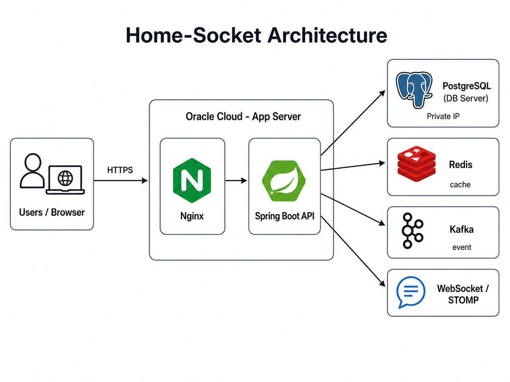

# Home-Socket 배포 및 운영 정리

Home-Socket은 Oracle Cloud 환경에서 애플리케이션 서버와 데이터베이스 서버를 분리해 배포했습니다.

## 배포 구조



```text
Client / Browser
→ HTTPS 443
→ Nginx Reverse Proxy
→ http://127.0.0.1:8081
→ Spring Boot App Container
→ PostgreSQL DB Server
```

Redis, Kafka는 애플리케이션 서버 내부에서 Docker Compose 기반으로 함께 운영했습니다.

```text
Spring Boot App
↔ Redis Cache
↔ Kafka Broker
↔ WebSocket / STOMP Notification
```

## 서버 구성

| 서버 | 역할 |
|---|---|
| App Server | Nginx, Spring Boot, Redis, Kafka, Docker Compose |
| DB Server | PostgreSQL |
| 네트워크 | App Server에서 DB Server private IP로 접근 |

## Docker Compose 구성

App 서버에서는 다음 서비스를 Docker Compose로 관리했습니다.

| Service | 역할 |
|---|---|
| `app` | Spring Boot 애플리케이션 |
| `redis` | 조회 API 캐시 |
| `kafka` | 결제 완료 이벤트 처리 |

Spring Boot app은 외부 포트로 직접 열지 않고 `127.0.0.1:8081`에만 바인딩했습니다.

```yaml
ports:
  - "127.0.0.1:8081:8081"
```

이 구성으로 외부 사용자는 Nginx를 통해서만 애플리케이션에 접근할 수 있습니다.

## Nginx Reverse Proxy

Nginx는 외부 HTTPS 요청을 내부 Spring Boot app으로 전달합니다.

```nginx
server {
    server_name leoan.p-e.kr;

    location / {
        proxy_pass http://127.0.0.1:8081;

        proxy_http_version 1.1;

        proxy_set_header Host $host;
        proxy_set_header X-Real-IP $remote_addr;
        proxy_set_header X-Forwarded-For $proxy_add_x_forwarded_for;
        proxy_set_header X-Forwarded-Proto $scheme;

        proxy_set_header Upgrade $http_upgrade;
        proxy_set_header Connection "upgrade";
    }
}
```

`X-Forwarded-*` 헤더는 Nginx 뒤에 있는 Spring Boot가 원래 요청의 protocol, host, client IP를 인식할 수 있도록 하기 위해 설정했습니다. OAuth redirect URI와 HTTPS 인식에도 필요합니다.

## HTTPS

Let's Encrypt / Certbot을 이용해 HTTPS 인증서를 발급하고, HTTP 요청은 HTTPS로 redirect되도록 구성했습니다.

## PostgreSQL 접근 제한

PostgreSQL은 별도 서버에서 운영하고, 외부 인터넷에 직접 노출하지 않는 것을 목표로 구성했습니다.

```text
Spring Boot App Server private IP
→ PostgreSQL DB Server:5432
```

DB 접속 정보는 `.env`에서 관리합니다.

## 운영 보안

| 항목 | 내용 |
|---|---|
| SSH | key-only 인증 |
| Root Login | 비활성화 |
| Nginx | Reverse Proxy 및 HTTPS |
| Fail2Ban | 비정상 요청 반복 IP 차단 |
| iptables | 80, 443, 8081 등 필요한 포트 제어 |
| OCI Security List | 외부 접근 포트 제한 |

## 배포 명령

App 서버에서 수동으로 app 컨테이너를 재생성할 경우:

```bash
cd ~/home-socket
docker compose -f docker-compose.prod.yml up -d --build --force-recreate app
```

상태 확인:

```bash
docker compose -f docker-compose.prod.yml ps
docker compose -f docker-compose.prod.yml logs --tail=200 app
```

Health check:

```bash
curl -i http://127.0.0.1:8081/v3/api-docs
```

## 참고

현재 배포 방식은 GitHub Actions에서 JAR를 빌드한 뒤 서버에 업로드하고, 서버에서 Docker image를 rebuild하는 구조입니다. 회사 운영 환경에서는 Docker image registry 기반 배포로 확장할 수 있습니다.
